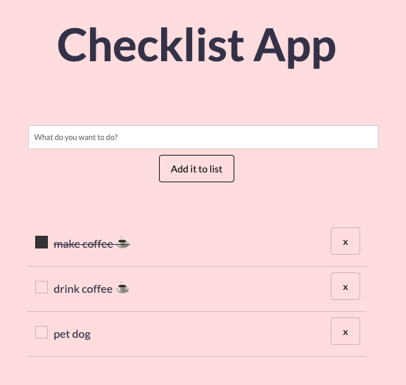

# 📋 Checklist App

A minimalistic browser checklist that utilises local storage so that you don't lose your to dos. 

Made with [Tachyons](http://tachyons.io/) CSS components. This app was intended as an exercise in the correct application of the MVC pattern in vanilla JavaScript.

## To use this app

1. Clone or download this repo

2. Open `index.html` in your browser. Your todos won't disappear on close unless you clear your browser storage.

